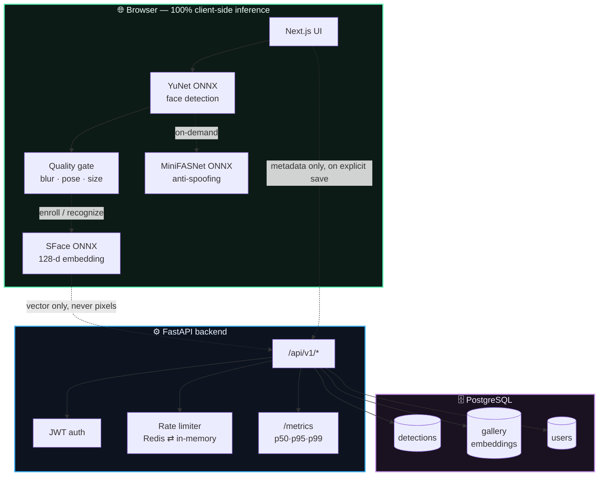

<div align="center">

# 👁️ FaceVision

### Privacy-first face detection that never leaves your browser

[](https://github.com/Pranjulrathour/FACEVISION-NEXTUPGRAD-/actions/workflows/ci.yml)


**[Live Demo](https://face-vision-frontend-production.up.railway.app)** · **[API Docs](https://face-vision-backend-production.up.railway.app/docs)** · **[Engineering Checklist](docs/face-detection-verification-checklist.md)**

</div>

---

## 🎯 At a Glance

<table>
<tr>
<td width="33%" valign="top">

### 🔒 Privacy by Design
Raw pixels **never leave your device**. Detection, embedding, and anti-spoofing all run client-side via ONNX Runtime Web. The backend only ever sees coordinates and vectors — never images.

</td>
<td width="33%" valign="top">

### ⚡ Real Models, Not Toys
YuNet detection, SFace recognition (96.9% verified accuracy on LFW), and MiniFASNet anti-spoofing — all verified byte-for-byte against their ONNX graphs and reference C++ source, not assumed from docs.

</td>
<td width="33%" valign="top">

### 🧪 Actually Tested
230+ automated tests across frontend and backend, a real load test against production that found and fixed a live bug, a 14-minute memory soak test, and an adversarial security suite.

</td>
</tr>
</table>

---

## 🧭 Table of Contents

| | | |
|---|---|---|
| [🏗️ Architecture](#-architecture) | [🖥️ Live Features](#-live-features) | [🚀 Quick Start](#-quick-start) |
| [🧠 Model Zoo](#-model-zoo) | [📡 API Reference](#-api-reference) | [🛡️ Security & Rate Limiting](#-security--rate-limiting) |
| [✅ Verification](#-verification) | [📊 Observability](#-observability) | [⚠️ Known Limitations](#-known-limitations) |
| [☁️ Deploy to Railway](#-deploy-to-railway) | [📚 Documentation Map](#-documentation-map) | [🤝 Contributing](#-contributing) |

---

## 🏗️ Architecture



<details>
<summary><strong>📁 Directory layout</strong></summary>

```
FACEVISION/
├── frontend/          Next.js app — every model runs here, in the browser
│   └── src/lib/       yunet.ts · sface.ts · minifasnet.ts · face-alignment.ts …
├── backend/           FastAPI — metadata/vector persistence only
│   ├── app/           routers → services → models (clean layering)
│   └── evaluation/    offline Python harness for accuracy benchmarking
├── database/          Postgres migrations
├── deployment/        Dockerfiles, compose, nginx, load-test script
└── docs/              ADRs, model cards, privacy policy, checklist, reports
```

</details>

| Layer | Stack |
|---|---|
| **Frontend** | Next.js 16 · React 19 · TypeScript · Tailwind CSS · ONNX Runtime Web |
| **Backend** | FastAPI · Uvicorn · SQLAlchemy 2 · PyJWT · bcrypt |
| **Database** | PostgreSQL 16 |
| **Cache / Rate limit** | Redis (optional, in-memory fallback) |
| **Deployment** | Docker · Railway · multi-stage builds |

---

## 🖥️ Live Features

| Panel | What it does |
|---|---|
| 🖼️ **Workspace** | Upload or live camera → face cards, confidence badges, annotated PNG export |
| 🕐 **History** | Thumbnail timeline of the last 100 detections, click to reload |
| 📈 **Stats** | KPI cards + 7-day trend chart |
| ⚖️ **Compare** | Landmark-geometry similarity between two faces, animated match meter |
| 🗂️ **Gallery** | Enroll a face under a name (real SFace embedding) → recognize it later |
| 🕵️ **Check Liveness** | Per-face button running MiniFASNet V2 anti-spoofing, client-side |
| ⚙️ **Settings** | Toggle history, labels, landmarks, colors, thresholds |

> **Privacy note:** the backend is entirely optional. Disable history persistence in Settings and FaceVision never talks to a server at all.

---

## 🚀 Quick Start

<table>
<tr><th>1️⃣ Database</th><th>2️⃣ Backend</th><th>3️⃣ Frontend</th></tr>
<tr valign="top">
<td>

```powershell
cd deployment/docker
docker compose `
  -f docker-compose.dev.yml `
  up -d
```

</td>
<td>

```powershell
cd backend
python -m venv .venv
.\.venv\Scripts\Activate.ps1
pip install -r requirements.txt
copy .env.example .env
python run.py
```

</td>
<td>

```powershell
cd frontend
npm install
npm run dev
```

</td>
</tr>
<tr><td colspan="3" align="center">

→ Backend: `http://localhost:8000/docs` &nbsp;·&nbsp; Frontend: `http://localhost:3000`

</td></tr>
</table>

Or the whole stack in one shot: `.\deployment\scripts\start.ps1 -Env prod`

---

## 🧠 Model Zoo

Every model here was verified against its actual ONNX graph and, where possible, the original reference implementation — not assumed from documentation.

| Model | Task | Input | Output | Verified accuracy |
|---|---|---|---|---|
| **YuNet** `2023mar` | Face detection | `1×3×640×640` | Boxes + 5 landmarks | — |
| **SFace** `2021dec` | 128-d recognition embedding | `1×3×112×112` aligned | 128-d vector | **96.9%** on 2200 real LFW pairs, ROC AUC **0.994** |
| **MiniFASNet** `V2` | Anti-spoofing | `1×3×80×80` | 3-class logits | user-triggered, not a security gate |

<details>
<summary><strong>📄 Model cards & decision records</strong></summary>

- [docs/model-card-yunet.md](docs/model-card-yunet.md)
- [docs/model-card-sface.md](docs/model-card-sface.md)
- [docs/model-card-minifasnet.md](docs/model-card-minifasnet.md)
- [docs/reports/evaluation-sface-lfw.md](docs/reports/evaluation-sface-lfw.md) — the full LFW benchmark writeup
- [docs/evaluation-methodology.md](docs/evaluation-methodology.md) — how those numbers were produced, and their honest caveats

</details>

All execution runs **WebGPU first, WASM fallback** — loaded once per session, never reloaded per detection.

---

## 📡 API Reference

All routes versioned under `/api/v1` (canonical). Unversioned `/api/...` paths still work but return a `Deprecation` header.

<details open>
<summary><strong>Detections · History · Stats · Compare</strong></summary>

| Method | Route | Description |
|---|---|---|
| `GET` | `/health` | Liveness check |
| `POST` | `/detections` | Store a detection (faces + metadata) |
| `GET` | `/detections?limit=&offset=&mode=` | Paginated list |
| `GET` | `/detections/{id}` | One record with faces |
| `DELETE` | `/detections/{id}` | Delete one record |
| `GET` / `DELETE` | `/history` | Alias + filtering / clear all |
| `GET` | `/stats` | KPI summary + 7-day trend |
| `POST` | `/compare` | Landmark cosine similarity |

</details>

<details>
<summary><strong>Gallery (real face recognition)</strong></summary>

| Method | Route | Description |
|---|---|---|
| `POST` | `/gallery/enroll` | Enroll an SFace embedding under a name |
| `GET` | `/gallery` | List enrolled identities |
| `DELETE` | `/gallery/{id}` | Remove an identity |
| `POST` | `/gallery/recognize` | Match an embedding against the gallery |

</details>

<details>
<summary><strong>Auth & Observability</strong></summary>

| Method | Route | Description |
|---|---|---|
| `POST` | `/auth/register` | Create an account, returns a JWT |
| `POST` | `/auth/login` | Exchange credentials for a JWT |
| `GET` | `/auth/me` | Current authenticated user |
| `GET` | `/metrics` | Per-route request counts, error rates, p50/p95/p99 |

A valid `Authorization: Bearer <token>` on gallery endpoints binds that data to the real authenticated user instead of a client-claimed session ID — see [ADR 0003](docs/adr/0003-minifasnet-liveness-and-jwt-auth.md). *(No frontend login form yet — use the API directly.)*

</details>

Interactive Swagger UI: `http://localhost:8000/docs`

---

## 🛡️ Security & Rate Limiting

| Env var | Default | Effect |
|---|---|---|
| `API_KEY` | unset | Gates write/destructive endpoints when set |
| `JWT_SECRET` | ephemeral fallback | HS256 signing key — **set explicitly in production** |
| `JWT_EXPIRE_MINUTES` | `10080` (7d) | Access token lifetime |
| `REDIS_URL` | unset (in-memory) | Shares rate-limit budget across replicas when set; falls back gracefully if unreachable — [ADR 0005](docs/adr/0005-redis-backed-rate-limiter-with-fallback.md) |
| `RETENTION_DAYS` | unset | Auto-purges detections older than N days |
| `DETECTIONS_RATE_LIMIT_PER_MIN` | `30` | Per-IP limit on detection writes |
| `AUTH_RATE_LIMIT_PER_MIN` | `10` | Deliberately tight — slows credential stuffing |

All configuration centralized in [`backend/app/core/config.py`](backend/app/core/config.py).

---

## ✅ Verification

| Suite | Coverage |
|---|---|
| 🧪 Frontend unit tests | **116** tests — detection, alignment, embedding, anti-spoofing, pipeline |
| 🧪 Backend unit tests | **122** tests — auth, gallery isolation, rate limiting, metrics, adversarial security |
| 🎯 Accuracy | 96.9% SFace verification accuracy, measured against 2200 real LFW pairs |
| 🩹 Memory soak | 170 detection cycles / 14 min against live prod — no leak found |
| 🔥 Load test | Run against production — found & fixed a real schema-drift bug in the process |
| 🔐 Adversarial security | Injection strings, payload boundaries, enumeration, auth bypass attempts |

```powershell
# Frontend
cd frontend && npm run typecheck && npm run lint && npm test && npm run build

# Backend
cd backend && pip install -r requirements.txt -r requirements-eval.txt && pytest -v
```

CI additionally runs `npm audit` and `pip-audit --strict` on every push — dependency CVEs fail the build.

```powershell
# Load test
k6 run deployment/scripts/load-test.js
```

---

## 📊 Observability

`GET /api/v1/metrics` — zero external dependencies, zero signup:

```json
{
  "uptimeSeconds": 41230.5,
  "routes": {
    "GET /api/v1/detections": {
      "requestCount": 812,
      "errorCount": 0,
      "errorRate": 0.0,
      "p50Ms": 12.4,
      "p95Ms": 38.1,
      "p99Ms": 61.7
    }
  }
}
```

Grouped by path *template* (`{detection_id}`, not the literal ID) so per-record traffic doesn't fragment the stats.

---

## ⚠️ Known Limitations

<details>
<summary><strong>Click to expand — the honest gaps, not hidden in prose</strong></summary>

| Area | Gap |
|---|---|
| Auth UI | Backend fully supports JWT auth; no frontend login/register form yet |
| Account deletion | No self-service endpoint — requires operator DB access |
| Rate limiting | In-memory by default; Redis-capable but not provisioned today |
| Liveness | MiniFASNet + heuristic are real signals but **not wired into any security gate** |
| Compare vs. Gallery | "Compare" is landmark-geometry similarity, not recognition — Gallery is the real embedding-based path |
| Gallery scale | Linear cosine-similarity scan, no vector index — fine at personal scale |
| Postgres | Single-node, no replication — back up the volume yourself |
| `gallery/recognize` | Intentionally not gated behind `API_KEY` (visitors need to use it) — rate-limited instead |

Full gap analysis and honest production-readiness assessment: [docs/face-detection-verification-checklist.md](docs/face-detection-verification-checklist.md).

</details>

---

## ☁️ Deploy to Railway


<details>
<summary><strong>Step-by-step environment variables</strong></summary>

**Backend** (`Root Directory` = `backend`):

| Variable | Value |
|---|---|
| `DATABASE_URL` | `${{Postgres.DATABASE_URL}}` |
| `API_KEY` | a real secret |
| `CORS_ORIGINS` | frontend's public URL |
| `JWT_SECRET` | a real secret |

**Frontend** (`Root Directory` = `frontend`):

| Variable | Value |
|---|---|
| `NEXT_PUBLIC_API_URL` | backend's public URL + `/api` (build-time!) |

Deploy order: **backend → get URL → frontend → get URL → set `CORS_ORIGINS` on backend → redeploy backend.**

Column-adding migrations self-heal on startup ([ADR 0004](docs/adr/0004-self-healing-column-migrations.md)) — no manual `psql` step needed.

Full guides: [`deployment/deployment.md`](deployment/deployment.md) · [`deployment/docker/readme.md`](deployment/docker/readme.md) · [`database/readme.md`](database/readme.md) · [`backend/readme.md`](backend/readme.md)

</details>

---

## 📚 Documentation Map

<table>
<tr><th>Architecture Decisions</th><th>Model Cards</th><th>Reports & Policy</th></tr>
<tr valign="top">
<td>

- [0001 · Landmark similarity vs. embeddings](docs/adr/0001-landmark-similarity-vs-embeddings.md)
- [0002 · SFace embeddings for gallery](docs/adr/0002-sface-embeddings-for-gallery-recognition.md)
- [0003 · MiniFASNet + JWT auth](docs/adr/0003-minifasnet-liveness-and-jwt-auth.md)
- [0004 · Self-healing migrations](docs/adr/0004-self-healing-column-migrations.md)
- [0005 · Redis rate limiter fallback](docs/adr/0005-redis-backed-rate-limiter-with-fallback.md)

</td>
<td>

- [YuNet](docs/model-card-yunet.md)
- [SFace](docs/model-card-sface.md)
- [MiniFASNet](docs/model-card-minifasnet.md)

</td>
<td>

- [LFW evaluation](docs/reports/evaluation-sface-lfw.md)
- [Load test results](docs/reports/load-test-results.md)
- [Evaluation methodology](docs/evaluation-methodology.md)
- [Privacy & retention policy](docs/privacy-retention-policy.md)
- [Full engineering checklist](docs/face-detection-verification-checklist.md)

</td>
</tr>
</table>

---

## 🤝 Contributing

Solo project today — see [CONTRIBUTING.md](CONTRIBUTING.md) for the review checklist and local verification steps.

## 📄 License

Private build for Pranjul Rathour.

<div align="center">

---

Built with a lot of ONNX graph inspection and not enough sleep. 👁️

</div>
